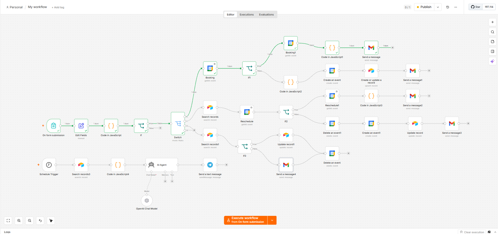

# 🦷 AI Dental Booking Assistant

> An AI-powered dental appointment management system built with **n8n**, **OpenAI**, **Google Calendar**, **Airtable**, **Gmail**, and **Telegram** to automate booking operations from start to finish.



---

# 📌 Overview

Managing appointments manually can be time-consuming and prone to scheduling conflicts. This project demonstrates how AI and workflow automation can streamline the entire appointment lifecycle by eliminating repetitive administrative tasks.

The AI Booking Assistant automatically validates requests, checks calendar availability, updates records, sends notifications, synchronizes appointments, and generates daily operational reports without manual intervention.

---

# 🎯 Objectives

- Automate appointment booking operations
- Prevent scheduling conflicts
- Eliminate repetitive administrative work
- Synchronize booking information across platforms
- Improve patient communication
- Provide real-time appointment reporting

---

# 🚀 Features

## 📅 Appointment Booking

- Accepts appointment requests through an online booking form
- Validates submitted information
- Checks Google Calendar for available time slots
- Prevents double-booking
- Creates Google Calendar events automatically
- Stores booking information in Airtable
- Sends professional confirmation emails

---

## 🔄 Appointment Rescheduling

- Retrieves existing appointment
- Verifies appointment ID
- Checks new schedule availability
- Deletes previous calendar event
- Creates updated Google Calendar event
- Updates Airtable records
- Sends updated confirmation email

---

## ❌ Appointment Cancellation

- Searches existing appointment
- Removes appointment from Google Calendar
- Updates booking status in Airtable
- Sends cancellation confirmation

---

## 🤖 AI Automation

- Intelligent workflow routing
- Automated decision making
- Data validation
- Error handling
- Conflict detection
- Record synchronization

---

## 📊 Daily Appointment Summary

Every day the system automatically:

- Reads all appointments
- Counts scheduled appointments
- Detects scheduling conflicts
- Identifies first and last appointments
- Generates operational summary
- Sends report to Telegram

Example:

```text
📅 Daily Appointment Summary

Thursday, July 23, 2026

━━━━━━━━━━━━━━━━━━

📊 Overview

Appointments : 5
Conflicts    : 0
Status       : ✅ Clear

━━━━━━━━━━━━━━━━━━

🕒 Schedule

09:00 AM — John Doe
10:00 AM — Jane Smith
11:00 AM — Michael Cruz
01:00 PM — Sarah Lee
03:00 PM — David Garcia

━━━━━━━━━━━━━━━━━━

First Appointment : 09:00 AM
Last Appointment  : 03:00 PM

Generated by SmileSync AI
```

---

# ⚙️ Technology Stack

| Technology | Purpose |
|------------|---------|
| n8n | Workflow Automation |
| OpenAI | AI Processing |
| Google Calendar API | Appointment Scheduling |
| Airtable | Booking Database |
| Gmail API | Email Notifications |
| Telegram Bot API | Daily Reporting |
| JavaScript | Business Logic |
| REST APIs | System Integration |

---

# 🏗️ System Architecture

```text
                    Patient

                       │

                       ▼

              Online Booking Form

                       │

                       ▼

              n8n Workflow Engine

                       │

        ┌──────────────┼──────────────┐

        ▼              ▼              ▼

 Google Calendar    Airtable      OpenAI

        │              │

        └──────┬───────┘

               ▼

      Decision & Validation

               │

      ┌────────┴─────────┐

      ▼                  ▼

 Gmail Notifications   Telegram Reports
```

---

# 🔄 Workflow Process

```text
Patient submits booking form
            │
            ▼
Validate request
            │
            ▼
Determine request type
            │
     ┌──────┼──────┐
     ▼      ▼      ▼
 Book  Reschedule Cancel
     │      │      │
     ▼      ▼      ▼
Google Calendar Operations
            │
            ▼
Update Airtable Database
            │
            ▼
Send Email Notification
            │
            ▼
Daily Telegram Summary
```

---

# 📂 Project Structure

```
AI Dental Booking Assistant
│
├── README.md
├── LICENSE
├── n8n.png
├── booking-form.png
├── workflow.png
├── airtable.png
├── calendar.png
└── telegram-summary.png
```

---

# 📸 Project Screenshots

## Online Booking Form


---

## n8n Workflow


---

## Airtable Database


---

## Google Calendar Integration


---

## Telegram Daily Summary


---

# 📈 Business Value

This automation helps clinics:

- Reduce administrative workload
- Prevent double-bookings
- Improve scheduling accuracy
- Automate patient communication
- Synchronize appointment records
- Increase operational efficiency

---

# ✅ Key Highlights

- End-to-end appointment automation
- AI-powered workflow decisions
- Google Calendar synchronization
- Airtable integration
- Automated Gmail notifications
- Telegram reporting
- JavaScript custom logic
- Real-time conflict detection
- Scalable workflow architecture

---

# 📊 Results

✔ Automated appointment booking

✔ Automated rescheduling

✔ Automated cancellations

✔ Zero manual scheduling

✔ Calendar synchronization

✔ Centralized booking database

✔ AI-assisted automation

✔ Daily operational reporting

---

# 🔮 Future Improvements

- SMS notifications
- WhatsApp integration
- Stripe payment integration
- Multi-clinic support
- Doctor availability management
- AI chatbot for patient inquiries
- Dashboard analytics
- Appointment reminder automation

---

# 👨‍💻 About the Developer

## Noriel Villanueva

**AI Automation Specialist | Workflow Developer**

I build AI-powered workflow automation solutions that eliminate repetitive business processes and improve operational efficiency using modern no-code and low-code technologies.

### Core Skills

- AI Workflow Automation
- n8n Development
- OpenAI Integration
- Business Process Automation
- API Integration
- Airtable
- Google Workspace Automation
- JavaScript
- CRM Automation

---

# 📬 Contact

**GitHub**

https://github.com/Nonetheless03

**LinkedIn**


**Email**

norielvillanueva210@gmail.com

---

# ⭐ Support

If you found this project helpful, consider giving it a ⭐ on GitHub.

It helps support future AI automation projects.
